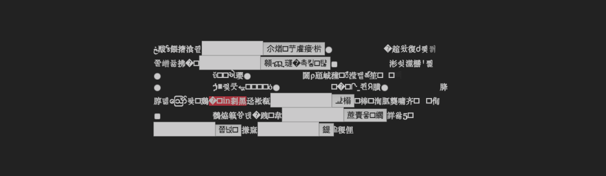

# *Burnt Matches*

# [Play Online](https://www.pippinbarr.com/burnt-matches) (desktop and mobile)

## Description
*Snow, but made of text! Rooms, but made of text! Stairs, but made of text! An elevator, but made of text! You’ll probably die, but made of text! These fragments I have shored against my ruins!*

*Burnt Matches* was written in [Twine](http://www.twinery.org) (1.4.2). It takes inspiration from _[Into Eternity](http://www.imdb.com/title/tt1194612/)_, directed by Michael Madsen, and inspiration and text from [The Wasteland](http://www.bartleby.com/201/1.html) by T. S. Eliot. The game was made as part of a Deep Time jam organised by the [Speculative Play](http://www.speculativeplay.com/) project at Concordia University.

## Documentation
* Read the [Process Documentation](../process) for todos, process journal, and blog posts
* Look at the [Code Repository](https://github.com/pippinbarr/) for source code etc.

## Press
Read the [Press Kit](../press) for press information

* Chris Priestman. [Pippin Barr's New Game Brings Concrete Poetry to Life](https://killscreen.com/articles/pippin-barrs-new-game-brings-concrete-poetry-life/). *Kill Screen*, 29 November 2016.

## License
*Burnt Matches* is licensed under a [Creative Commons Attribution-NonCommercial 3.0 Unported License](http://creativecommons.org/licenses/by-nc/3.0/).
