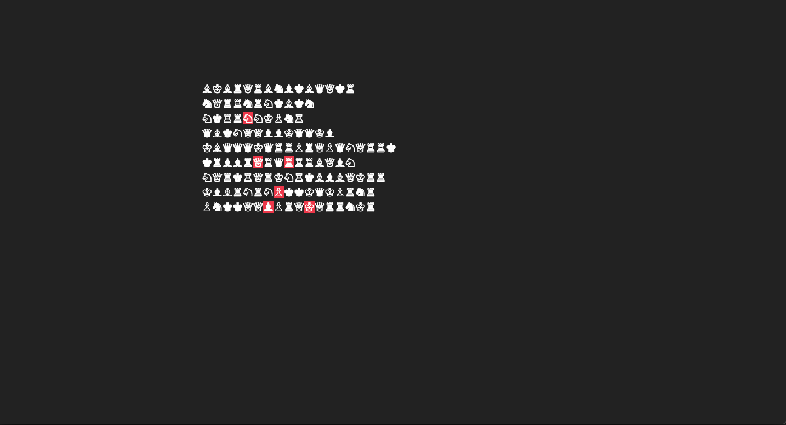
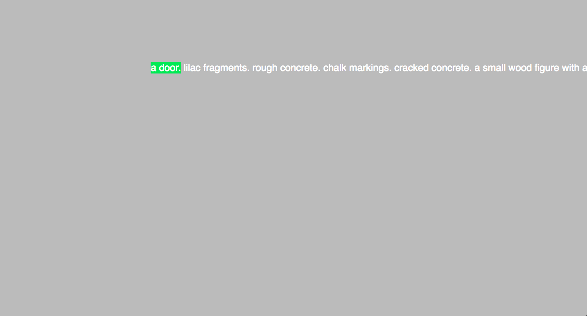
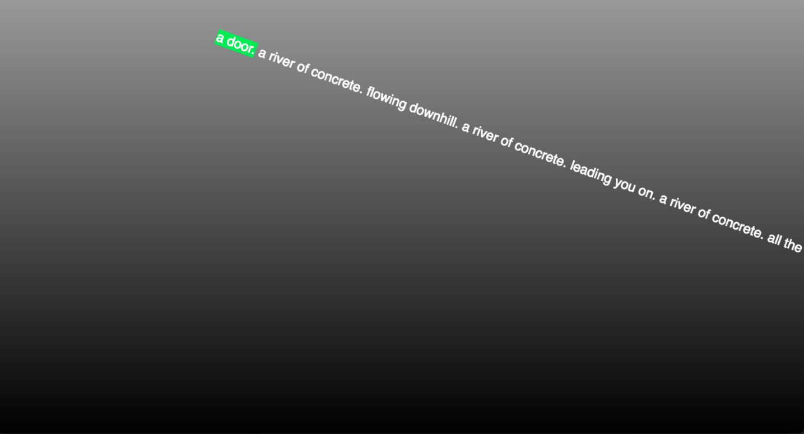
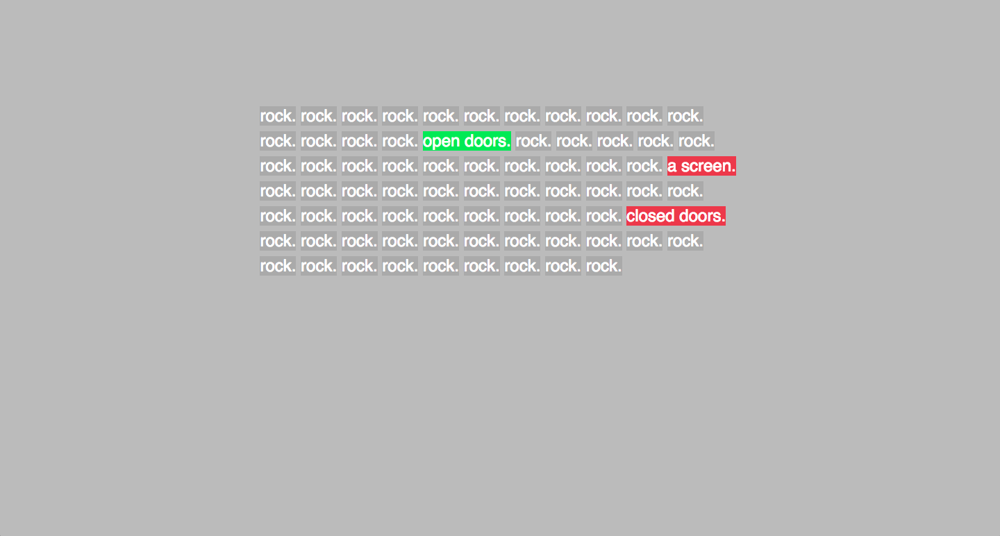
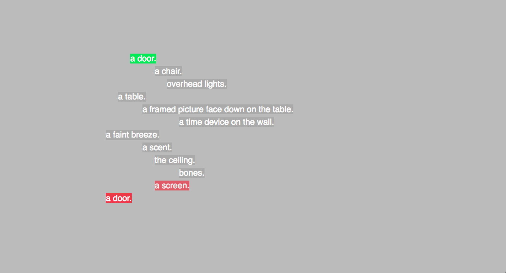
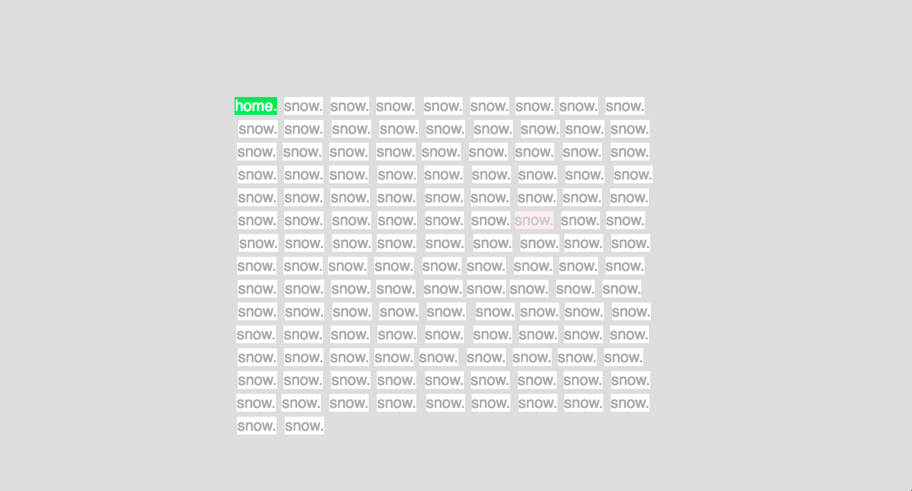
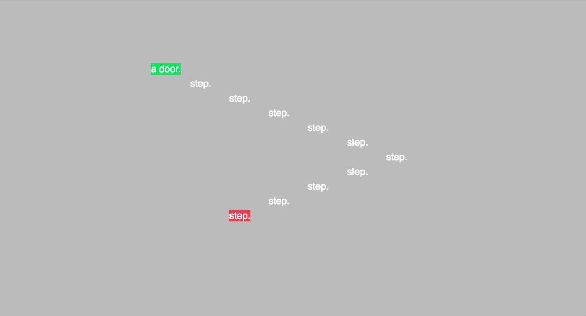
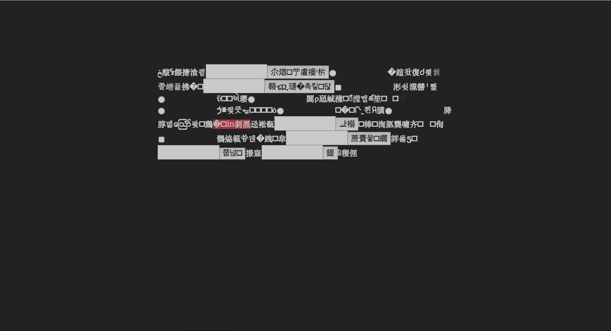

# *Burnt Matches*

## Information
* Released: November, 2016
* Website: http://www.pippinbarr.com/games/
* Platforms: Browser
* Link: https://www.pippinbarr.com/burntmatches/
* Price: Free.

## Description
Snow, but made of text! Rooms, but made of text!  
Stairs, but made of text! An elevator, but made of text!  
You'll probably die, but made of text!  
These fragments I have shored against my ruins!

## History
  "Burnt Matches" was begun as part of the Deep Time Jam conducted
  by the (FRQSC Team Research-Creation supported) Speculative Play
  project run by Rilla Khaled, Chris Moore, Brian Greenspan, and myself.
  The jam itself was based around an opening activity of watching the
  (excellent) documentary Into Eternity by Michael Madsen. The documentary
  focuses on a nuclear waste disposal facility in Finland called
  Onkalo, and the planning and construction devoted to making a building
  that is meant to last for about 100,000 years. A key idea that we
  all latched onto was the idea of people in the "deep" future encountering
  the facility and how you would help them to understand what it was
  and in particular that it is a dangerous place they should not enter.

  I ended up wanting to make a representation of the facility itself
  with the idea of incomprehensible computer interfaces in a language
  that has been lost by the time the player encounters them. I spent
  most of the jam working on learning enough about integrating JavaScript
  and Twine to create randomly-generated alien UIs with the unicode
  character set and CSS animations. They looked pretty cool, but that's
  all I got done.

  Post jam I found myself wanting to continue with the actual building
  of the facility itself. But I got very stuck on how to do the writing
  involved, because I haven't been much of a writer of fiction for
  a long time, and I was unsure of things like the tone of the language,
  how descriptive to be, how to address the player, and so on. I was
  eventually rescued by the idea of using text to represent the space
  itself, rather than to describe the space, so "Burnt Matches" is
  partly about representing spaces "directly" in Twine/HTML rather than
  representing through narrative text. This allows for very "blank"
  actual text, but expressiveness through spatial structures, animation
  and small amount of link-based interactivity.

  The second piece of the puzzle was that I did still want poetic
  language to be a part of the project, so it wasn't an entirely blank
  spatial representation of the facility. My mind found its way to
  T. S. Eliot's poem "The Wasteland" (something I've been obsessed with
  in the past), and I ended up using both the thematic/language aspects
  of the poem (e.g. imagery of rock, thunder, water, hyacinths, etc.)
  along with the actual structure of the poem itself, which is in
  five parts themed around particular "elements" in a way (water, thunder
  earth, etc.). In fact I even took text directly from the poem itself
  in the later parts of the Twine. In some ways I might almost view "Burnt
  Matches" as a form of adaptation of the poem into a new form, though
  only loosely.

  And that's about it. Once I had the core idea of representing this
  space through "spatial text" along with The Wasteland to give me
  some language to hold onto, it was mostly a matter of doing battle
  with JavaScript and HTML/CSS to make the Twine look and feel (and
  sound) the way I wanted as much as possible. It's probably one of those
  Twines that might almost have been better off being built from
  the ground up in straight HTML/CSS/JavaScript, but I do also like
  it being "a Twine" with the various aesthetic implications that can
  have.

## Features
* Snow, but made of text!
* Rooms, but made of text!
* Stairs, but made of text!
* An elevator, but made of text!
* You'll probably die, but made of text!

## Images

## Trailer
[View trailer on YouTube](https://www.youtube.com/watch?v=N2zBn8msiHk&ab_channel=PippinBarr)

## Links
### Speculative Play
You can find more information about the Speculative Play research project here:
http://www.speculativeplay.com/

### Into Eternity, directed by Michael Madsen
This is a very interesting documentary! http://www.imdb.com/title/tt1194612/

### The Wasteland, by T. S. Eliot
The original poem is available in lots of places, including: http://www.bartleby.com/201/1.html

## Credits
* Pippin Barr: Everything
