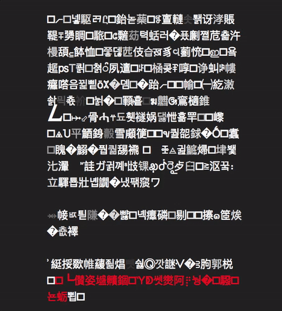
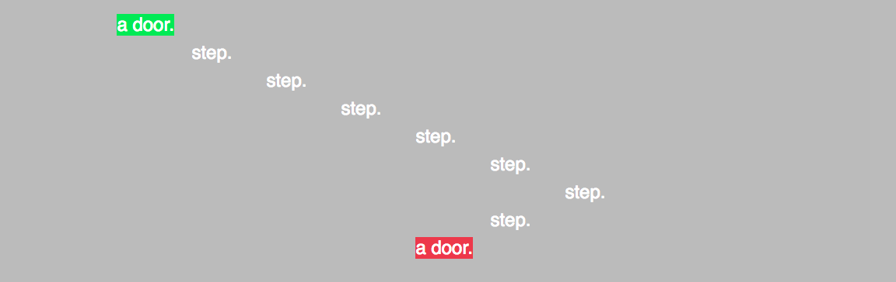

# Blog Posts

Here are public-facing blog posts I wrote while making the game.

## Challenge Foolishly Accepted: Twine Edition (2016-10-31)

You know that thing where you&#8217;re supposed to challenge yourself to make work outside your comfort zone because you&#8217;ll grow as an artist and gain the respect and adulation of your peers?

Not a good idea.

Well, at least, I&#8217;ve been trying to do pretty much exactly lately and I can&#8217;t say that it&#8217;s been going well. For the last several weeks my only faint thrashings of game making have been going toward making a Twine I&#8217;m calling _Burnt Matches_. The project stems from a very brief attempt to make a text-based &#8220;thing&#8221; at a design jam we had back in late September around the documentary &#8220;[Into Eternity](https://en.wikipedia.org/wiki/Into_Eternity_(film))&#8221; &#8211; a film you should absolutely watch because it&#8217;s terrific. It&#8217;s about the long-term storage of nuclear waste and I was imagining some kind of system of interfaces that would theoretically keep people out of such a facility, or trap them in, or&#8230; something. Anyway the thing I made looked like the animated GIF at the top of this post &#8211; an ever-changing set of paragraphs and links utilising the entire Unicode character set.

Being bloody-minded, I was pretty determined to &#8220;just finish&#8221; this Twine after the jam ended (at which point I basically only had the interface element constructed in a way I liked), but then there was also the small matter of the university semester being fully under way and me teaching three classes a week and grading and&#8230; well, it hasn&#8217;t been working out very well.

Not least of all because I&#8217;ve also decided to try to be &#8220;original&#8221; with Twine and do some stuff that I haven&#8217;t necessarily seen elsewhere (inspired in part by some of the efforts of students in my game studio class who hated Twine as a tool but produced some quite striking results with it). The combined pressures of my job and the desire to make something good has mostly crushed my spirit. Frankly I&#8217;m normally at my best when I just try to make &#8220;anything&#8221; rather than striving to best a tool at its own game. But I&#8217;m stuck, but I&#8217;m totally unable to walk away from projects and shelve them, so I&#8217;m pretty much in this scenario where I&#8217;m going to sit here trying to finish the thing before I allow myself to move on to any other projects (of which I have a couple in mind).

Pretty depressing blog post? Yeah, tell me about it &#8211; at least you&#8217;re not me!

(But really, it&#8217;s not so bad. I imagine I&#8217;ll get it done in the next week or two? And it might even be an okay thing by the end of it? You be the judge! Later!)

## Text Adventures (2016-11-10)

Haha, as in &#8220;adventures with text&#8221;.

Anyway, I&#8217;m still working away on this Twine I&#8217;ve been making in fits and starts since late September called Burnt Matches. At this point I have pretty much the whole thing structurally done, and it&#8217;s been a wild ride trying to do something that (I feel) is interesting with text and layout on webpages. One way or another I&#8217;ve kind of drifted toward a model of text and text animation as representative of space rather than &#8220;description&#8221; per se. Not that that&#8217;s original or anything, but that&#8217;s what&#8217;s happening as I try to grapple with the &#8220;story&#8221; involved (about penetrating into a hidden/forgotten facility for storing nuclear waste). Strange given that the project started mostly with an interest in modelling alien-feeling user interfaces for that facility. The interfaces are still there, but they&#8217;ve been really backgrounded by this spatial stuff.

But the weird thing of all about this project has been just how damn complicated it&#8217;s been trying to work with text in the way I want to. Feels like I&#8217;m pushing on Twine in ways it doesn&#8217;t particularly care to be pushed on. Vast swathes of the game are written as overelaborate macros of JavaScript that generates pages of text/space rather than writing it in terms of Twine&#8217;s interface. So an entire sequence of events on a page in the Twine might be coded in the Twine interface as &#8220;<<generatewasteland>>&#8221; or something, which pulls in a bunch of JavaScript to do the heavy lifting. Feels unnatural and like I&#8217;m right at the edge of this actually being a sensible project to build in Twine in the first place.

This is especially true as I run into performance problems with the &#8220;Twiney&#8221; ways I initially wanted to use for aesthetic effects. Notably there are a bunch of places where I want to have text flashing, say, and I&#8217;ve been implementing that with macros from Twine (like the excellent <<timedcycle>>). Except that it turns out that&#8217;s got really awful performance if you do a lot of it on a single page, which I need/want to do. Today, fortunately, I discovered that there are often ways to pull off exactly the same visual effect through CSS instead, which turns out to perform really well. So I&#8217;m now migrating various effects to CSS in reduce the load the passages have in the browser, to try to prevent them from taking a second or two to actually load. There&#8217;s more work to do on that front, but it&#8217;s getting there. Thank good I teach a web art course at my university so I actually at least have a faint idea of how to do these sorts of things.

Anyway, the huge irony of this to me is that my games almost never need to &#8220;worry&#8221; about performance in the engines I&#8217;ve used, because they&#8217;re just so simple and trivial for the engines to handle (hardly any sprites, not much physics, not many moving parts, etc.). And yet now, working with Twine, ostensibly an incredibly lightweight and &#8220;simple&#8221; way to make a game, I&#8217;m running into honest-to-goodness performance issues that I&#8217;m having to optimise away like a real programmer.

The project as a whole feels like it&#8217;s been a series of weird tastes of forms of game design and development that I generally don&#8217;t go in for traditionally, from working with text for representation, to optimisation issues, to trying to actually build a narrative environment, etc. Really been a strange project. Fortunately, the more I&#8217;ve worked on it, the more I find that kind of rewarding rather than the &#8220;depressing&#8221; I&#8217;ve been rating it earlier on when it was just dragging on and felt like an ugly child I didn&#8217;t want to be responsible for. It&#8217;s still probably super ugly, but hopefully ugly in that way that it turns out to be strangely beautiful and walks down catwalks with great flair.

That&#8217;s enough out of me. Bye.

## Code Descending a Staircase (2016-11-14)

Getting closer and closer to this Twine o&#8217; mine _Burnt Matches_ being done. Currently going back and forth through its various spaces making sure everything actually works, which had mostly been fine until I got to the staircase in the game. As I believe I wrote last time, a big part of the game for me has been doing various bits of spatial representation through text, and the staircase was one of the earliest things I put in that I really quite liked – you walk down an arbitrary number of steps by clicking link after link until you get to the bottom and find a door (the screenshot up there shows the screen after you&#8217;ve gone down all the stairs). It works pretty well to convey the idea of stairs with text and space rather than just saying &#8220;you walk down some stairs&#8221; or whatever. And that&#8217;s important to the nature of the game, because a big element is feeling like there&#8217;s effort involved to get through the various spaces &#8211; not challenging effort, more like &#8220;trivial effort&#8221; actually, but something that takes you time and requires determination.

Anyway today&#8217;s big nightmare was realising that because I want the player to be able to back through the facility they&#8217;re in and leave at any time, I actually needed to have it be possible to walk up the stairs as well as down them. That turned out to not be easy at all because the staircase is a moderately terrifying jumble of javascript that generates Twine code and inline CSS that generates the staircase itself. It ain&#8217;t pretty, and working out how to kind of write it &#8220;backwards&#8221; was harder than it was writing it forwards.

Eventually I did get it working (through rather more trial and error than a better person would have allowed), but it again strikes me as so funny some of the situations I end up with the text game. There&#8217;s so much &#8220;physical&#8221; stuff in the world of the game I fighting with Twine to represent, and of course you end up with these very fragile representations, like a flight of stairs you can go down but not up. Whereas in an engine like, say, Unity, if you make a set of stairs and an avatar, that&#8217;s that, the stairs are stairs in the good old fashioned physical sense.

On the other hand perhaps the sheer difficulty of representing these architectures in text (and space) will magically form some part of their aesthetic experience for a player? Maybe?

Probably not.

That&#8217;s okay. We stonemasons don&#8217;t expect to be recognised by you stair-walking dilettantes.
